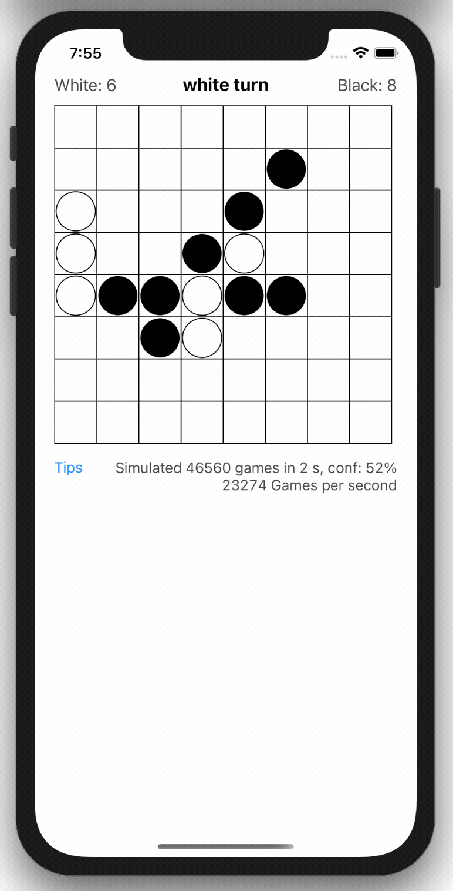

# Monte Carlo Tree Search for Othello

[Monte Carlo tree seach](https://en.wikipedia.org/wiki/Monte_Carlo_tree_search) (MCTS) is a method of implementing game AI (among other things). Possible current game moves are sampled by randomly playing a game to the end from each move. The move which seems to lead to wins most often is the best move to make next.

 

Implemented using Swift for iOS. Updated for Xcode 12.

Copied more or less directly from http://andysalerno.com/2016/03/Monte-Carlo-Reversi
